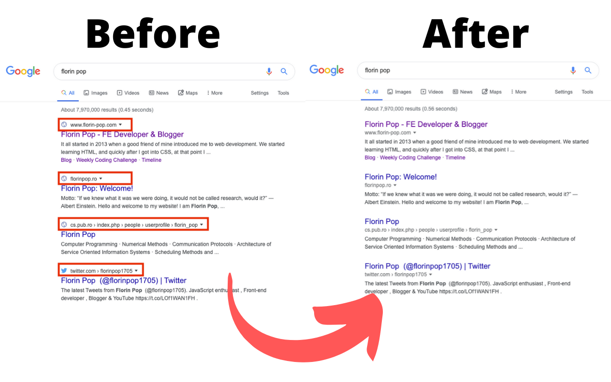

# goOLDgle

A browser extension which brings back the old Google search design before the 2020 update.

# Install

Currently you can install this addon on **Firefox** here: [Firefox goOLDgle Add-on](https://addons.mozilla.org/en-US/firefox/addon/gooldgle/)

We are still waiting for approval for **Chrome** and **Edge**.

In the meantime, you can download this repo and add manually the **goOLDgle** folder as an extension for **Chrome** (and **Brave**):

## Easy steps

1. Download (or clone) this repository
2. Go to **chrome://extensions/** in your browser
3. Drag and Drop the extension folder (**goOLDgle**) anywhere onto the extensions page in Chrome.

# Created By

[@florinpop1705](https://twitter.com/florinpop1705) and [@maioralin](https://twitter.com/maioralin) - Twitter handles.
